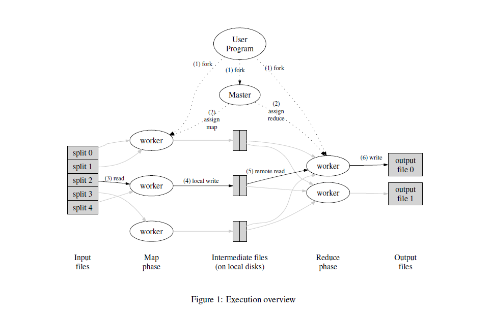

# 在集群模式下, MapReduce 使数据处理变得更简单

## 摘要

MapReduce 是一种编程模型，适用与大数据处理。用户只需定义map() 和 reduce() 函数就能对数据进行处理：

* map: 将原始数据映射为 key-value 的键值对
* reduce：争对key-value键值对， 对相同的 key, 合并他们的 value

程序使用函数式编程模型编写，自动具有并行和在集群上运行的能力，用户不需要关心并行和分布式系统，让运行时系统来关心如何对输入数据进行分片，调度跨集群的程序执行，处理错误，管理机器间通信。

## 1. 介绍

MapReduce 应用场景：

* web 文档
* web 请求日志
* 倒排索引

MapReduce 解决的问题：

​	屏蔽了并行，容错，分布式数据，负载均衡方面的细节，使编写大数据处理的代码更加简单。

用户编写 map、reduce 函数，运行时系统负责并行化，如果机器发生了错误，只需要在另外一台机器上重新执行 map、reduce。

## 2. 编程模型

### 例子

map-reduce 统计文档集单词出现次数

伪代码：


举例说明：

文档1名称为：doc1，内容为：

hello world, hello map

文档2名称为：doc2，内容为：

hello world, hello reduce

map 产生的结果：

```
doc1 应用map 函数后:
<hello,1> <world, 1>, <hello,1>, <map, 1>
doc2 应用map 函数后:
<hello,1> <world, 1>, <hello,1>, <reduce, 1>
doc1 应用 reduce 函数后:
<hello, 2>, <world, 1>, <map,1>
doc2 应用 reduce 函数后:
<hello, 2>, <world, 1>, <reduce,1>
合并 doc1 和 doc2 的结果：
<hello, 4>, <world, 2>, <map,1>, <reduce,1>
```

### 应用场景

* 分布式查找
* 计算 url 访问次数
* 反转链接图
* 倒排索引
* 分布式排序

## 3. 实现

map-reduce 有许多种不同的实现，来使 map-reduce 在各种不同的集群规模达到一个比较好的性能。

以下介绍 Google 的大规模集群环境：

* 集群中的 PC 由商用 PC 组成
* 机器处理器为 X86, 运行在 Linux 上，每台机器内存在 2-4G 左右
* 使用商用网络硬件，每台机器 100 megabits/second 或者 1 gigabit/second， 但是平均总体带宽小于参数值
* 集群有上百台到几千台机器
* 机器使用 IDE 硬盘存储数据，使用内部的分布式存储系统来管理数据，通过数据备份来实现可用性和可靠性
* 用户提交作业给调度系统，每个作业包含多个任务，调度系统来决定如何执行作业。

### 3.1 执行概览

通过切分输入数据，使 map 过程可以并行和分布式执行。

reduce 过程通过 map 生成的 key-value 键值对，reduce 过程利用 partition() 函数，对中间结果进行分区，使相同的key 在同一个分区，达到 reduce 过程并行和分布式执行。



如上图所示，用户提交作业后，map-reduce 执行概览。

1. 对输入数据进行切分，切分成 16-64MB, 用户可以通过参数进行控制。
2. 上图中有两个角色：Master, Worker。Master 选择空闲的 worker 分配任务，worker 对任务执行 map 或者reduce 操作。
3. 当 worker 收到一个 map 任务时，worker 用输入数据，调用用户自定义的 map 函数，产生中间结果 key-value 键值对，中间结果时存放在内存中的。
4. 周期的将内存中的中间结果写入本地磁盘中，在写入磁盘的过程中，会根据 Key 调用 partition() 函数进行分区，写入完成后，会将分区路径返回给 master, master 然后分配 reduce 任务 worker。
5. 当woker 收到一个 reduce 任务，同时也也会包含一组分区路径，reduce 利用远程调用读入数据。当数据读入完毕后，根据 Key 进行分组。如果数据量太大，会利用外部排序来辅助完成这个过程。
6. 现在 reduce 任务转化为一个类似 map 的结果 `Map<key, List<Value>>`, 遍历每一个key, 取出 `List<Value>`， 交给用户定义的 reduce() 函数。
7. 当所有的 map 任务和 reduce 任务执行完毕后，master 会通知用户程序已经执行完毕。

### 3.2 Master 数据结构

* 保存每一个 map 任务和 reduce 任务的状态（未运行，运行中，已完成）。
* 保存每个 worker 的身份，如 map-worker, reduce-worker。
* 保存 map 任务执行后中间结果分区后的路径，并将这些信息传递给 reduce-worker。

### 3.3 容错

#### worker容错

master 通过心跳机制判断 worker 是否宕机，如果在一段时间内，master 没有收到 worker 的响应， master 会标记这台 woker 宕机了，

所有由这台 worker 已完成的 map 任务都会重置状态为未运行，让其他 worker 重新执行这些 map 任务。

相似的，这个 worker 正在执行中的 map 和 reduce 任务都会重置状态为未运行状态，让其他 worker 重新执行。

Q: 为什么已完成的 map 任务需要重新执行？

A: 因为 map 过程的存储结果存放在本地磁盘上，宕机后，reduce-worker 通过RPC 也不能获得 map 的结果。

Q: 为什么已完成 reduce 任务不需要重新执行？

A: 因为 reduce 产生的结果存放在分布式文件系统中。

当一个 worker-A 执行完毕一个 map 任务后，然后宕机了，master 会分配这个map 任务交给 worker-B 执行，所有的 reduce-worker 都会收到通知重新执行，从 worker-B 上获取数据。

MapReduce 能容忍大规模的 worker 宕机，如网络维护期间，在几分钟内，多台机器不可达，MapReduce 只需重新执行这些不可达机器所执行的任务，使作业继续向前推进，直到作业完成。

#### master 容错

mater 会周期性的写 checkpoint, 保存上述的 mater 持有的数据结构，如果 master 宕机了，会产生一个新的 master 从上次的 ckeckpoint 出开始执行。

#### 出现失败时语义

如果用户定义的 map 和 reduce 函数是确定性的（deterministic）， 即函数的解决只依赖与输入，举例说明：如果函数结果不仅与输入有关，还与当前的时间相关，那么该函数就不是确定性的。

如果 map 和 reduce 函数是确定性的，那么当 worker 失败时，重新执行任务，没有任何影响。

每一个 map 和 reduce 任务提交都是是原子的，每个正在运行的任务的输出写入临时私有的文件中。一个 reduce 任务产生一个文件，map 任务产生 被分区函数partition() 生产的 R 个文件。

当 map-worker 执行完成后，map-worker 发送消息给 master, 消息包含 R 个文件的路径，如果 master 已经收到过这个任务完成的消息了，master 会忽略这条消息，如果没有收到过，master 会保存消息。

当 reduce 任务执行完成后，reduce-worker 会对文件进行改名，将临时文件改为最终的文件。

因为 reduce-worker 失败的关系，如果这个 reduce 任务在多台上执行，多个reduce-worker 都会执行这个改名操作，MapReduce 依赖于分布式文件系统提供的改名操作的原子性。保证多个 reduce-worker 执行产生的结果只有一份。

当 map 和 reduce 函数是确定性，那么产生的结果就如同单机顺序执行一样。

当不是确定性的，MapReduce 提供弱一点但是合理的语义。

假设：e(Ri) 代表 reduce 任务Ri 的执行。

map-worker 第一产生的结果为 M1, e(R1) 的输入是 M1，但当 map-worker 宕机后，另一台 map-woker 重新执行，输出结果是M2, 那么 e(R1) 会调整输入为 M2。

### 3.4 局部性

网络带宽是一种相对稀缺的资源。

输入数据通常是保存在 GFS 文件系统中，GFS 划分文件在 64M 的块中，MapReduce 的时候， master 会利用这些信息，尽量让 map 操作在本地执行，减少网络传输。

### 3.5 任务粒度

切分输入数据为 M 个片，每个片由 map-worker 处理，map 过程将会产生 R 个区。

Q: 那么 M 和 R 应该如何取值？

A: master 会做 O(M+R) 次调度决策，保存 O(M*R) 个任务执行信息。通常 M的划分使一个 map 任务的输入在 16-64M 之间，可以利用上诉的 GFS 的局部性，R 设置为 worker 的小的倍数。

如 Google MapReduce 2000 台 worker 的集群，M 通常为 200000， R 通常为 5000

### 3.6 任务备份

某一些机器因为各种原因可能会执行map-reduce 任务特别慢。

* 该机器由硬盘故障，读写由 30M/s 降低到 1M/s。
* 调度器给这台 worker 发访了更多得任务。

还有各种原因，这几台比较慢得 worker 无疑会极大得增加任务总体的执行时间。

Q: map-reduce 如何解决这个问题？

A: 当大多数任务都执行完毕后，有空闲的 worker ， master 会将余下的这些正在运行的任务同时分配给空闲 worker 执行。谁先执行完就接受谁的结果。

## 改进

尽管只需提供 map, reduce 函数就能满足大多数需求了，但这里还是有一些有用的扩展。

### 4.1 分区函数

分区函数的目的是经可能的将相同的 key 分到同一个区。

默认的分区函数：`hash(key) mod R`, 是比较好的公平划分分区的方法。

可是如果 key 是 URL, 想要将同一个站点下的划分为同一个区，就可以通过自定义分区函数为：`hash(Hostname(urlkey)) mod R`, 让相同的站点下的文档划分到同一个分区。

### 4.2 顺序保证

保证在一个分区内，数据是依据 key 递增的。这保证了随机访问的效率。

### 4.3 合并函数

举个单词统计的例子: 统计单词出现的频率，但是有些单词出现的频率特别高，如一篇文档进行map 操作后会产生大量的 `<the, 1>`这样的键值对，全部发送给 reduce 任务是没有必要的，增加了网络传输的时间，可以先在本地进行合并，然后将合并后的结果发送给 reduce-worker。

大多数合并函数的 reduce 函数都是相同的，但是他们的输出不一样，合并函数的输出是中间文件，稍后会将中间发送给 reduce-worker。reduce 的输出是分布式文件系统。

### 4.4 输入和输出类型

用户可以自定义输入和输出函数，来从各种输入格式读取数据，输出各种格式的数据。

### 4.5 副作用

如果用户在程序中输出了一些中间文件或操作数据库条目，Map-Reduce 需要用户自己来实现原子性和幂等性。用户必须要考虑 worker 失败，任务被重新执行的情况。

### 4.6 跳过坏记录

有时用户代码有一些 bug, 在处理某些记录时发送错误，用户最好的选择时修复这些 bug, 但是对于 bug 修改不了的情况，如该 bug 出自第三方的库，Map-reduce 提供给用户一个选择，可以跳过这些坏记录。

每一个 worker 都有一个信号处理器，当用户代码发生错误时，会将对于记录的标号发送给 master， master 会标记这条记录，下次执行时，会跳过对应的坏记录。

### 4.7 本地执行

因为 map-reduce 运行在分布式环境中，用户不易于 debug 和测试，为了方便用户，Map-reduce 	也有本地执行的模式。

### 4.8 状态信息

master 提供一个内部的 http 服务，可以通过这些信息了解多少任务执行完毕，多少任务正在执行，观察 worker 的失败信息。

### 4.9 计数器

如果用户了解一些附加信息，如参与 Map-reduce 过程的单词数量。

伪代码：

```
Counter* uppercase;
uppercase = GetCounter("uppercase");
map(String name, String contents):
	for each word w in contents:
		if (IsCapitalized(w)):
		uppercase->Increment();
	EmitIntermediate(w, "1");
```

worker 上的记数器的值周期性（心跳频率）的发送给 master, master 会将技术器的值展示在状态信息上，如果任务重新执行，计数也只计数一次。

MapReduce 内部也维护了一些计数器，如产生的 key-value 键值对。

## 参考文档

[MapReduce: Simplified Data Processing on Large Clusters](./mapreduce.pdf)

[MapReduce —— 历久而弥新](https://zhuanlan.zhihu.com/p/66312401)

